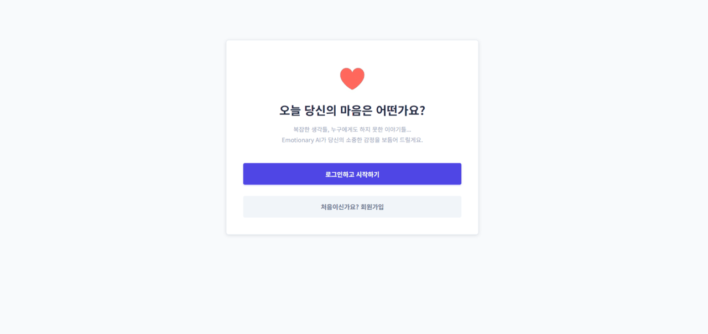

# 📔 Emotionary AI

> **일기 데이터 기반 감정 기록 서비스**  
> 하루의 감정이 그냥 지나가지 않도록, AI가 감정을 이해하고 정리해주는 감정 일기 웹 서비스입니다.

---

## 👥 Team 5조
<table>
  <tr>
    <td align="center" width="180">
      
      <br />
      <b>김은혜</b><br/>
      <sub>PM / Full-stack</sub><br/>
      <a href="https://github.com/eeeunhey">@eeeunhey</a>
    </td>

    <td align="center" width="180">
      
      <br />
      <b>강혜정</b><br/>
      <sub>Full-stack</sub><br/>
      <a href="https://github.com/hj626">@hj626</a>
    </td>

    <td align="center" width="180">
      
      <br />
      <b>김재혁</b><br/>
      <sub>Full-stack</sub><br/>
      <a href="https://github.com/waguwagu796">@waguwagu796</a>
    </td>

    <td align="center" width="180">
      
      <br />
      <b>나상훈</b><br/>
      <sub>Full-stack</sub><br/>
      <a href="https://github.com/timothykr7-jpg">@timothykr7-jpg</a>
    </td>

    <td align="center" width="180">
      
      <br />
      <b>임다빈</b><br/>
      <sub>Full-stack</sub><br/>
      <a href="https://github.com/1st312">@1st312</a>
    </td>
  </tr>
</table>


---

## ✨ 프로젝트 소개

**Emotionary AI**는 사용자가 작성한 일기 내용을 바탕으로  
AI가 감정을 분석하고, 감정 요약과 코멘트를 제공하는 웹 서비스입니다.

감정을 직접 선택하지 않아도  
글 속에 담긴 감정을 AI가 이해하여 정리해주며,  
시간이 지나 다시 감정을 돌아볼 수 있는 경험을 제공합니다.

---

## 🎯 제작 배경

- 감정은 분명하지만 시간이 지나면 쉽게 희미해짐
- 기존 감정 기록 앱은 감정 선택 중심 → 흐름 파악이 어려움
- 글 기반 감정 분석을 통해 더 자연스러운 기록 경험 제공

---

## 🧩 주요 기능

- 👤 **사용자 인증**: 회원가입 / 로그인 (세션 기반)
- ✍ **일기 작성**: 날짜별 자유 형식 감정 기록
- 🤖 **AI 감정 분석**: Gemini API 기반 감정 분류
- 💬 **감정 코멘트**: 분석 결과에 따른 AI 요약 문장 제공
- 📖 **기록 조회**: 일기 목록 및 감정 흐름 확인

---

## 🔄 User Flow

1. 회원가입 / 로그인  
2. 일기 작성  
3. 일기 저장  
4. AI 감정 분석  
5. 감정 결과 + 코멘트 확인  
6. 기록 목록 조회  

---

## 🖥 실행 화면

### 👤 회원 로그인 / 회원가입



### ✍ 일기 입력 화면


### 🤖 감정 분석 결과 화면


## 🎥 전체 시연 영상
[](video/emotionary_demo.mp4)
---

## 📁 프로젝트 구조

```
daily-emotion-log_team/
 ├─ static/        # 이미지, CSS
 ├─ templates/     # HTML 템플릿
 ├─ app.py         # Flask 앱 실행
 ├─ db.py          # DB 연결
 ├─ emotion.py     # 감정 분석 로직
 ├─ .env           # 환경 변수
 └─ README.md
```

---

## 🛠 기술 스택

<a href="https://github.com/msdio/stackticon">
  
</a>

- **Frontend**: HTML, CSS, JavaScript  
- **Backend**: Flask (Python)  
- **Database**: MariaDB  
- **AI**: Google Gemini API  
- **Deploy**: Cloudtype  
- **Collaboration**: GitHub, Git  

---

## 🌱 프로젝트 회고

- Git 협업 규칙 부재로 인한 충돌 경험 → PR 기반 협업의 중요성 인식
- 단일 app 구조의 한계 → App Factory + Blueprint 리팩토링 필요성 인지
- AI API 연동 및 배포 환경 변수 관리 경험

---

## 🔮 향후 계획

- 감정 분석 고도화 (세분화된 감정 분류)
- 감정 캘린더 및 그래프 시각화
- 일기 검색 / 필터 / 내보내기 기능
- UI/UX 및 코드 구조 리팩토링

---

